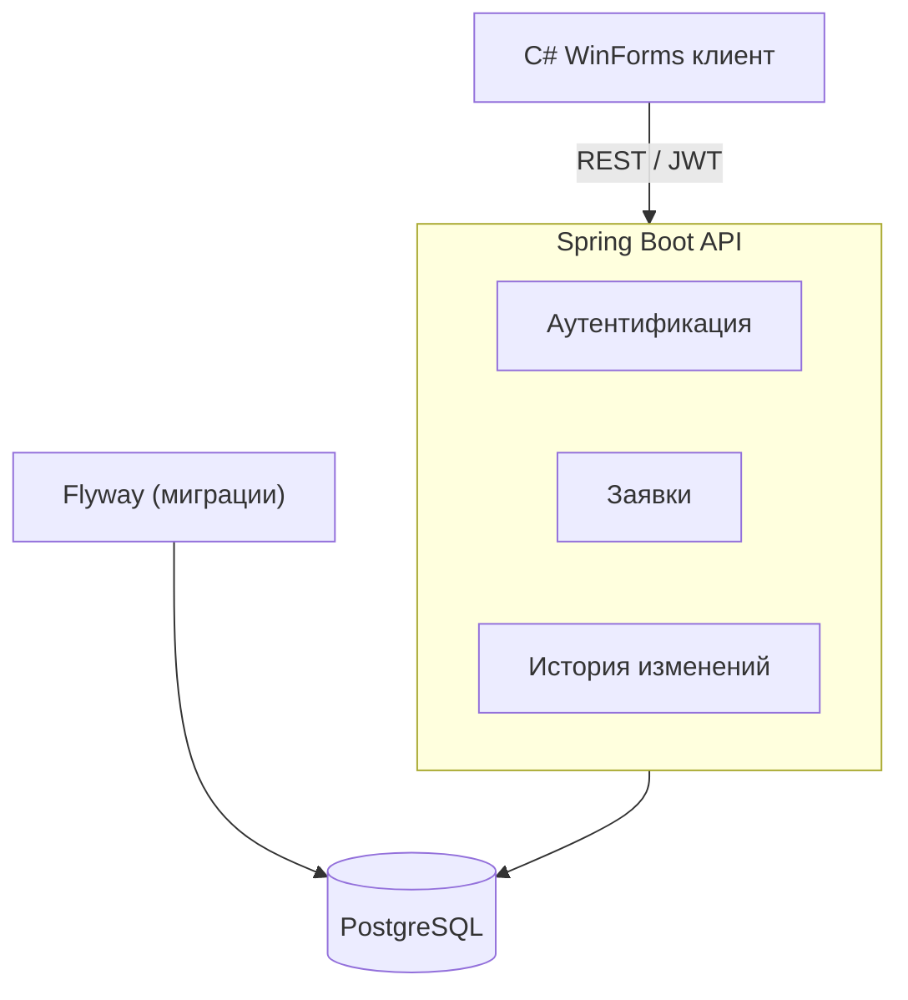

# RequestFlow Mini

[](https://github.com/eremeevsystems/requestflow/actions/workflows/backend-ci.yml)

Демонстрационная система управления внутренними заявками.

Проект показывает реализацию backend-системы на Java/Spring Boot: REST API, ролевая модель доступа, JWT-аутентификация, PostgreSQL с миграциями Flyway, история изменений заявок, Docker и автоматизированные тесты с CI.

## Архитектура



Backend построен по слоистой архитектуре с разделением ответственности:

```
Controller → Service → Repository → PostgreSQL
```

- **Controller** — REST-эндпоинты, валидация входных данных;
- **Service** — бизнес-логика: ролевая модель, переходы статусов, история;
- **Repository** — доступ к данным через Spring Data JPA.

Вся система (API + база) поднимается одной командой через Docker Compose.

## Демонстрационный сценарий

Единственный сценарий, которого достаточно, чтобы показать реальную backend-разработку:

1. Пользователь создаёт заявку.
2. Руководитель назначает исполнителя.
3. Исполнитель видит заявку.
4. Исполнитель меняет статус на «В работе».
5. После выполнения переводит её в статус «Выполнена».
6. Система сохраняет историю изменений.

## Технологии

### Backend

- Java
- Spring Boot
- Hibernate
- PostgreSQL
- Flyway
- REST API
- JWT-авторизация
- Роли пользователей
- OpenAPI/Swagger
- Docker Compose
- Unit- и integration-тесты (JUnit 5, Mockito, Testcontainers)
- CI на GitHub Actions

### Клиент

Небольшой клиент на C#:

- экран авторизации;
- список заявок;
- карточка заявки;
- смена статуса.

## Модель данных

Всего три основные сущности: `User`, `Request`, `RequestHistory`.

### Роли

- `MANAGER`
- `EXECUTOR`

### Заявка (Request)

| Поле         | Описание                    |
|--------------|-----------------------------|
| `id`         | Идентификатор               |
| `title`      | Заголовок                   |
| `description`| Описание                    |
| `priority`   | Приоритет                   |
| `status`     | Статус                      |
| `createdBy`  | Автор заявки                |
| `assignedTo` | Назначенный исполнитель     |
| `createdAt`  | Дата создания               |
| `updatedAt`  | Дата последнего обновления  |

### Статусы заявки

- `NEW`
- `ASSIGNED`
- `IN_PROGRESS`
- `COMPLETED`

## Тесты и CI

Тесты backend делятся на два уровня:

- **unit** — бизнес-логика сервисов и JWT (JUnit 5 + Mockito);
- **integration** — сквозные API-тесты через MockMvc против реальной PostgreSQL в Testcontainers: полный жизненный цикл заявки, авторизация, права доступа, валидация.

Запуск:

```bash
cd backend
mvn test
```

> Для integration-тестов нужен Docker (Testcontainers поднимает PostgreSQL в контейнере). Без Docker можно запустить только unit-тесты: `mvn test -Dtest='!RequestFlowApiIntegrationTest'`.

CI настроен на GitHub Actions (см. бейдж выше): на каждый push и pull request в `main` собирается проект и прогоняются все тесты.

## API

Полная спецификация — в [openapi.yaml](openapi.yaml). После запуска доступна интерактивная документация Swagger UI: http://localhost:8080/swagger-ui/index.html

```
POST   /auth/login
POST   /requests
GET    /requests
GET    /requests/{id}
PATCH  /requests/{id}/assignee
PATCH  /requests/{id}/status
GET    /requests/{id}/history
```

## Запуск

1. Скопируйте пример переменных окружения:

   ```bash
   cp .env.example .env
   ```

2. Запустите приложение и базу данных через Docker Compose:

   ```bash
   docker-compose up --build
   ```

3. После успешного запуска:
   - backend API доступен по адресу: http://localhost:8080
   - документация Swagger UI: http://localhost:8080/swagger-ui/index.html
   - база данных PostgreSQL доступна на порту `5432`
